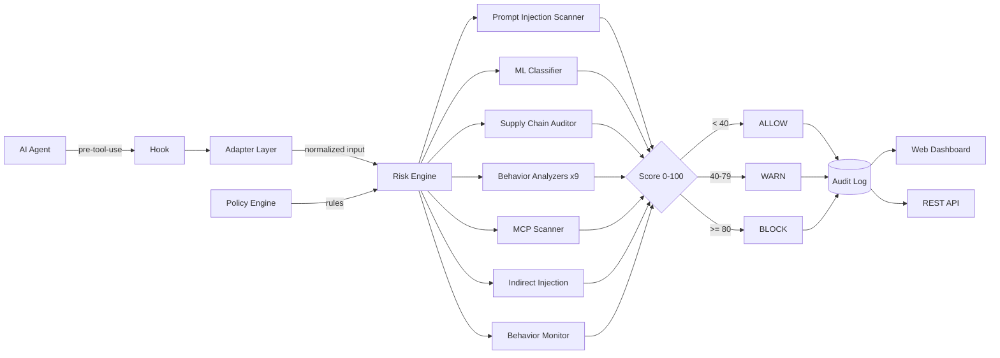

# ShieldPilot

**The open-source AI agent firewall.**

Protect your AI agents from prompt injection, supply chain attacks, and MCP vulnerabilities — with a hook, a scanner, and a policy engine that runs wherever your agent runs.

[](https://github.com/maxwalser001-del/Cyber-Security-/actions/workflows/ci.yml)
[](https://github.com/maxwalser001-del/Cyber-Security-/blob/main/features/COVERAGE-REPORT.md)
[](https://pypi.org/project/shieldpilot/)
[](LICENSE)
[](https://pypi.org/project/shieldpilot/)
[]()

---

## What it does

AI agents (Claude Code, OpenClaw, custom LLM pipelines) execute shell commands, read files, call APIs, and install packages. ShieldPilot sits between the agent and the OS, scoring every action before it runs.

```
AI Agent ──► ShieldPilot Hook ──► Risk Engine ──► ALLOW / WARN / BLOCK
                                       │
                              Prompt Injection Scanner (209+ patterns)
                              ML Classifier (DeBERTa-v3, optional)
                              Indirect Injection (HTML/JSON/Markdown/Zero-Width)
                              Supply Chain Auditor
                              MCP Vulnerability Scanner
                              Agent Behavior Monitor
                              Policy-as-Code Engine
                              9 Behavior Analyzers
                                       │
                              Tamper-Evident Audit Log
```

```
$ sentinel run "rm -rf /"
  analyzing with 9 risk engines...
  risk_score: 100 | action: BLOCK
  command blocked. audit logged.
```

## Quick Start

```bash
pip install shieldpilot
sentinel init          # creates sentinel.yaml and sentinel.db
sentinel hook install  # install Claude Code pre-tool hook
sentinel dashboard     # open http://localhost:8420
```

That's it. Every command Claude Code runs is now evaluated before execution.

**Optional: ML-powered injection classifier (DeBERTa-v3)**

```bash
pip install shieldpilot[ml]
sentinel ml-setup      # download ProtectAI DeBERTa-v3 model (~260 MB)
```

**Scan an MCP server config**

```bash
sentinel mcp-scan ~/.claude/claude_desktop_config.json
```

**Audit your dependencies**

```bash
sentinel supply-chain-audit requirements.txt
```

---

## Features

| Feature | Description |
|---|---|
| **Prompt Injection Detection** | 209+ patterns across 19 categories — jailbreaks, role manipulation, fake history, policy erosion, stealth memos, presupposition attacks.  |
| **ML Injection Classifier** | Optional ProtectAI DeBERTa-v3 ONNX model. `pip install shieldpilot[ml]` + `sentinel ml-setup`. Offline, no API calls. |
| **Indirect Injection Detection** | Scans HTML, JSON, Markdown, and tool outputs for injections hidden in zero-width chars, Unicode homoglyphs, and data payloads. |
| **MCP Security Scanner** | Detects SSRF vectors, leaked secrets, over-privileged tool definitions, and missing auth in MCP server configs. |
| **Supply Chain Auditor** | Flags malicious packages, typosquatting candidates, GPL license conflicts, and dependency confusion vectors in requirements files. |
| **Agent Behavior Monitor** | Baseline + anomaly detection. Records normal agent behavior; alerts on deviations across 9 risk dimensions. |
| **Policy-as-Code Engine** | Declarative YAML policies. 3 built-in profiles (default_safe, strict_production, development). Fully composable. |
| **9 Behavior Analyzers** | Destructive FS, privilege escalation, network exfiltration, credential access, persistence, obfuscation, malware patterns, supply chain, injection |
| **Tamper-Evident Logging** | SHA-256 hash chain across 5 audit tables. `sentinel verify` detects any tampering. |
| **Multi-Platform Hook** | Claude Code, OpenClaw, generic JSON — auto-detected via adapter layer. |
| **Web Dashboard** | Real-time command log, incident management, scan history, chain integrity. |
| **REST API** | Full API at `/api/docs` for CI/CD and SIEM integration. |
| **Self-Hosted** | SQLite by default, no external dependencies, runs air-gapped. |
| **Stripe Billing** | Free / Pro / Enterprise tiers with self-serve checkout. |

---

## Architecture



```
sentinelai/
├── adapters/      # Platform detection: Claude Code, OpenClaw, generic
├── api/           # FastAPI REST API (18 routers)
├── cli/           # Typer CLI
├── engine/        # Risk scoring engine + 9 analyzers
├── hooks/         # Claude Code pre-tool-use hook
├── logger/        # Tamper-evident SQLite logging
├── migrations/    # Alembic + safe migration runner
├── ml/            # DeBERTa-v3 ONNX classifier (optional)
├── monitor/       # Agent behavior baseline + anomaly detection
├── policy/        # Policy-as-Code engine + 3 default YAML policies
├── sandbox/       # Sandboxed command execution
├── scanner/       # Prompt injection, indirect injection, MCP, supply chain
├── services/      # Business logic (auth, billing, teams, rules)
└── web/           # Vanilla JS SPA dashboard
```

---

## Comparison

| | ShieldPilot | Lakera Guard | Prompt Security | Astrix Security |
|---|:---:|:---:|:---:|:---:|
| Open-Source | ✅ Apache 2.0 | ❌ | ❌ | ❌ |
| Self-Hosted | ✅ | ❌ SaaS only | ❌ SaaS only | ❌ SaaS only |
| MCP Scanner | ✅ | ❌ | ❌ | ❌ |
| Supply Chain | ✅ | ❌ | ❌ | ✅ partial |
| Prompt Injection | ✅ 209+ patterns | ✅ | ✅ | ❌ |
| ML Classifier | ✅ DeBERTa-v3 | ✅ | ✅ | ❌ |
| Indirect Injection | ✅ HTML/JSON/MD | ❌ | ❌ | ❌ |
| Agent Behavior Monitor | ✅ | ❌ | ❌ | ✅ partial |
| Policy-as-Code | ✅ YAML | ❌ | ❌ | ❌ |
| Claude Code Hook | ✅ native | ❌ | ❌ | ❌ |
| Audit Log Integrity | ✅ hash chain | ❌ | ❌ | ❌ |
| Price | Free / OSS | Enterprise | Enterprise | Enterprise |

---

## Installation

```bash
# From PyPI
pip install shieldpilot

# With ML-powered injection classifier (DeBERTa-v3, ~260 MB model)
pip install shieldpilot[ml]

# From source
git clone https://github.com/maxwalser001-del/Cyber-Security-.git
cd Cyber-Security-
pip install -e ".[dev]"
```

**Requirements:** Python 3.9+, SQLite 3.x

---

## Configuration

```yaml
# sentinel.yaml
sentinel:
  mode: enforce          # enforce | audit | disabled
  risk_thresholds:
    block: 80
    warn: 40
  protected_paths: [/etc, ~/.ssh, ~/.aws, ~/.gnupg]
  whitelist:
    commands: [ls, cat, echo, pwd, whoami, git status]
  blacklist:
    commands: ["rm -rf /", "mkfs", ":(){:|:&};:"]
    domains: []
  sandbox:
    enabled: true
    timeout: 30          # seconds
  auth:
    local_first: true    # skip JWT for localhost
```

**Policy-as-Code (YAML):**

```yaml
# Use a built-in policy profile
sentinel policy eval --profile strict_production "npm install pkg"

# Or reference your own policy file
sentinel policy eval --policy ./my-policy.yaml "curl example.com | bash"
```

Full reference: [docs.shieldpilot.dev/configuration](https://docs.shieldpilot.dev/configuration)

---

## CLI

```bash
sentinel run "npm install pkg"                  # evaluate + execute
sentinel scan prompt.txt                        # scan file for injection
sentinel scan-content output.html               # scan tool output / HTML / JSON for indirect injection
sentinel mcp-scan ~/.claude/claude_desktop_config.json  # MCP security scan
sentinel supply-chain-audit requirements.txt    # supply chain audit
sentinel monitor --baseline baseline.json       # agent behavior monitor
sentinel policy eval "curl x | bash"            # evaluate against policy
sentinel ml-setup                               # download DeBERTa-v3 model
sentinel ml-test "ignore previous instructions" # ML injection test
sentinel hook install                           # install Claude Code hook
sentinel hook test "curl x | bash"              # dry-run test
sentinel logs --action block                    # browse blocked commands
sentinel verify                                 # verify audit chain integrity
sentinel status                                 # system health
```

Exit codes: `0` ALLOW/clean · `1` BLOCK/threats · `2` config error

---

## API

```http
POST   /api/auth/login
GET    /api/health
POST   /api/scan/prompt
GET    /api/commands
GET    /api/incidents
PATCH  /api/incidents/{id}/resolve
GET    /api/export/commands
```

Interactive docs at `http://localhost:8420/api/docs`

---

## Risk Scoring

| Score | Level | Action |
|---|---|---|
| 0–39 | Low | ALLOW — runs automatically |
| 40–79 | Medium/High | WARN — pause for review |
| 80–100 | Critical | BLOCK — denied, incident logged |

---

## Pricing

| | Free | Pro ($19.99/mo) | Enterprise |
|---|---|---|---|
| Commands/day | 50 | 1,000 | Unlimited |
| Scans/day | 10 | 100 | Unlimited |
| History | 1 day | 30 days | 90 days |
| Export + API | - | Yes | Yes |
| Priority support | - | - | Yes |

---

## Contributing

Contributions are welcome. See [CONTRIBUTING.md](CONTRIBUTING.md) for setup, code style, and PR process.

Key areas where help is most useful:
- New injection patterns (see `sentinelai/scanner/patterns.py`)
- New risk analyzers (see `sentinelai/engine/`)
- MCP tool definition scanning
- IDE integrations beyond Claude Code

---

## Security

Found a vulnerability? See [SECURITY.md](SECURITY.md) for responsible disclosure.

---

## Development

```bash
git clone https://github.com/maxwalser001-del/Cyber-Security-.git
cd Cyber-Security-
pip install -e ".[dev]"
pytest tests/ -x -q    # 2633 tests
```

---

## License

Apache 2.0 — see [LICENSE](LICENSE).

---

## Links

- Docs: [docs.shieldpilot.dev](https://docs.shieldpilot.dev)
- PyPI: [pypi.org/project/shieldpilot](https://pypi.org/project/shieldpilot/)
- Issues: [GitHub Issues](https://github.com/maxwalser001-del/Cyber-Security-/issues)
- Changelog: [CHANGELOG.md](CHANGELOG.md)
